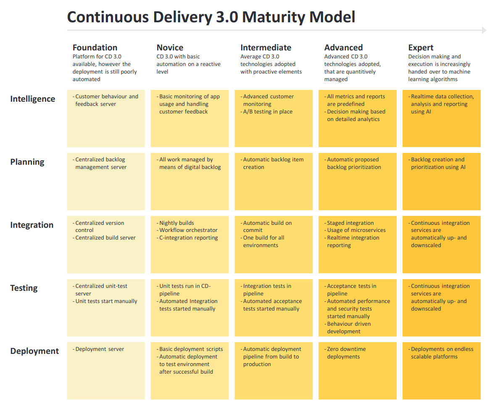

# go_githubCI
This README outlines several ideas that should drive a company's CI/CD development.  
A selection of the mentioned ideas is implemented as POC following a <XXX> identifier referenced in the commit messages.  
The ideas for which more complex infrastructure is required(e.g. binary caches, databases,...) will be omitted or will appear later once I learn to make them happen using Github goodies.

## Overall goals
For me, your company's CI/CD environment has to answer to main questions.  
One: What is going on with our product? Whenever I build, test and deliver IT capabilities, spot progress and regressions. Have a feedback loop that makes sense in terms of your product and team.  
Two: How are different players interacting with each other and how are they consuming products originated by your CI/CD environment?  
Get every role in your team the right version of your product fast. Pipeline A delivers arguments in the form of artifacts to pipeline B.

## Local CI/CD
Whenever possible enable your team members to run pipeline subtasks locally in a comfortable manner. <001>  
This will not force them to commit every time they wanna check whether a change passes tests and other criteria.  
This will also reduce the load your shared CI/CD infrastructure needs to handle.

## Isolation and security
Pipelines shouldn't be able to make a mess out of each other.  
Digital signature or hash checks ensure that the pipeline is running on the building blocks it is supposed to.  
Check third-party libraries for vulnerabilities and malicious code aka point to a certain version.

## Limit unnecessary runs
It might not be necessary to trigger every capability of your CI/CD environment just because of some update in a feature branch.  
Provide flags for skipping CI internals to relieve the infrastructure your CI is running on without enabling untrusted pushes to the trunk of your project.

## In case of an emergency
In a situation where one unspotted bug is breaking production, you need to be able to publish a fix immediately.  
For that matter, it is advisable to enable trusted users to bypass CI elements while making use of only the most essential CD parts.

## Team
CI/CD development needs to align with the work ethics of your team (e.g. branching strategy).  
The more natural and equal processes align the more team members will understand what issues they face and what matters the need to communicate.

## Resources
Make use of the same test environment as often as possible.  
Cache all sorts of artifacts while not creating an artifact with the same meaning twice.  
Test by hand what is too unique and too costly to implement.  
Avoid unnecessary builds and tests that might delay feedback.  
Run pipelines in a predetermined order where the most fragile steps come first to shorten feedback loops.  
clean up after you are done

## Documentation & testing
Your CI/CD environment needs documentation and it needs testing.  
Tweak your team members' workflows so they have room for both.

## Outlook
The following image I found in ["Continous Integration (CI) and Continous Delivery (CD)"](https://link.springer.com/book/10.1007/978-1-4842-9228-0) by Henry van Merode.  
Whenever I look at it it provides me with the urge to make progress at work.  
I hope it fits your taste as well.  

